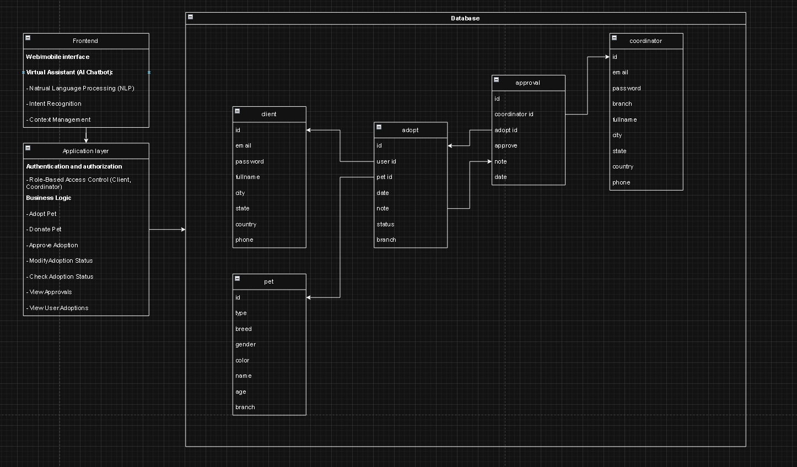

## Open Source Programs
<p align="center"> PetMe with virtual assistant integration</p>

<br>
<h1 align="center">PetMe</h1>
<h3 align="center">"Bringing Hearts and Paws Together"</h3>
<p align="center">
  
  </p>

## Project descriptiont:

This project is made for a university level task mainly focused on artificial intelligence integration, so most of the current features are lacking foolproofs, not achieving any specific user stories. 

The assistant is proposed for this project so it could help users interact with the need to adopt a pet in a more natural way and less forms for context, requesting the user for the informations which they could be missing.

## How to run

Make sure to have python (3.11.9) installed

It is recommended to use VS Studio Code version 1.99.3 (2022) and install the specified libraries in requirements.txt by running
```
pip install -r requirements.txt
```

You must then have to get openai key which you could get here: https://platform.openai.com/api-keys and find config.json in ./data/config folder where you can input the api key, you can leave thread ID and assistant ID to blank as long as you have the api key. 

Compile the code by running ''' python3 ./app.py '''

## Features

<p align="center">
  
</p>

Added authentication for users. currently there are 2 accounts with different roles: The client and the coordinator, currentltly, it is not possible to create a coordinator account, only by terminal.
- The client, is able to interact with the virtual assistant to: adopt a pet, check the adoption status of a pet, donate a pet and check reason specified for that status.
- You can log into the client by email "test@test.test" and password is "test"

- The coordinator, is also able to donate a pet, check the adoption status and check the reason specified for the status. However, adopting a pet is only for clients, the coordinator has exclusive features such as approving an adoption, check for the approvals that the current coordinator has made and modify an existing approval.
- You can log into the coordinator by email "co@co.co" and password is "co"

All functions included in the functions folder with explanations

## Interaction examples

<p align="center">
  
</p>

- "I'd like to adopt Bella" - try calling `adopt` with name = "Bella"
- "Can I donate my 2-year-old orange male cat from LA?" - extract all fields for `donate_pet`
- "I want to approve Bella's adoption and note that the adopter included all necessary documents" - extract all fields for `approve`, if the user approves, return 1 (integer) to the `approve` parameter, return -1 (integer) if reject
- "I want to modify Bella's adoption status to rejected because the adopter did not have enough documents" - call `modify_status` tool
- "I want to check Bella's adoption status" - call `check_adoption_status` tool
- "I want to see all the approvals I have made" - call `check_approval` tool, all outputs from the tool are pet names
- "I want to see all the pets I am adopting" - call `check_user_existing_adopt` tool, all outputs from the tool are pet names

## Architecture diagram

<p align="center">
  
</p>

## Future updates

- Allowing every user to have their own thread ID
- Increase security level for every account
- Allowing natural coordinator account creation
- User can interact with assistant without an account, but will then require their contact informations
